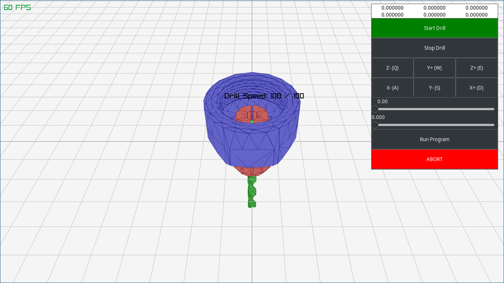

## Overview

  

This is a program for sending control data to GRBL-compatible CNC machines via
serial connection. It has two modes of operation: you can either send control
signals like setting the speed of the spindle or commanding movement on an axis,
or you can send a file full of g-code to execute as a batch.

## Usage

## Options

## Equipment

## Environment

## Limitations

## Dependencies

## License

This work is licensed under the GNU General Public License version 3 (GPLv3).

